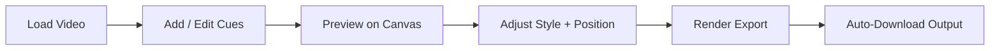

# 8-Bit Dialogue Caption Maker

Browser-first tool for creating retro game-style dialogue captions for short-form video.

It is optimized for reels/shorts workflows:
- timeline-based cue editing
- live canvas preview
- social-safe caption placement
- one-click rendered export

## UI Preview


## What It Does

- Creates timed dialogue/choice/dramatic caption cues
- Renders retro pixel dialogue windows and text animation
- Supports cue-level dramatic move/resize
- Supports global dialogue drag override
- Keeps captions inside social-safe bounds (IG/TikTok/YouTube Shorts)
- Exports either:
  - `Composite` (source + captions)
  - `Overlay` (chroma layer for keying in an external editor)

## Full Functionality

- Source workflow: load local video, see source resolution, preview timeline duration
- Cue authoring: add/edit/remove cues with precise start/end time and mode-specific behavior
- Cue modes: dialogue, action choice, dramatic; plus instant-show and dramatic text-only flags
- Cue portability: export/import cues as JSON (positions and sizing included)
- Timeline tools: drag cues to retime, resize start/end directly, playhead seek
- Position controls:
  - social-safe clamping for IG/TikTok/YouTube Shorts (default)
  - manual dialogue/choice move override saved in local draft
  - dramatic cue move + resize in edit mode
- Live preview controls: play/pause, mute, loop, fullscreen
- Undo support: `U` or `Ctrl/Cmd + Z` for recent editing actions
- Export/render:
  - composite output or chroma-key overlay mode
  - fps/container options with browser fallback handling
  - optional audio track inclusion when supported
  - stop/cancel render action
  - auto-download exactly once per successful render run
  - manual re-download link remains available

## Visual Workflow



## Cue Types

- `dialogue`: classic box + paging arrow
- `choice`: prompt + options list with a right-pointing chevron selector
- `dramatic`: larger text band, per-cue move/resize, optional text-only mode

## Choice Cue Example

Use `>` in cue text to mark selected option:

```text
What will you do?

>Call back
Go to her
Let her go
```

Rendered output shows a right-pointing chevron marker for the selected row.

## Positioning Modes

- `Use social-safe positioning` (default): clamps captions to conservative safe area
- `Manual dialogue position override`: drag dialogue/choice box in preview and save globally
- Dramatic cues remain independently draggable/resizable per cue in edit mode

## Run Locally

### Option A: Python static server

```bash
# run from the project root
python3 -m http.server 1234
```

Open: [http://127.0.0.1:1234](http://127.0.0.1:1234)

### Option B: Live reload

```bash
# run from the project root
npx --yes live-server . --port=1235 --no-browser
```

Open: [http://127.0.0.1:1235](http://127.0.0.1:1235)

## Keyboard Shortcuts

- `Space`: play/pause
- `S`: jump to start
- `M`: mute toggle
- `C`: add cue at playhead
- `E`: toggle edit selected cue
- `X`: delete selected cue
- `U` or `Ctrl/Cmd + Z`: undo

## Quick Start

1. Load a source video.
2. Add one or more cues (start/end + text).
3. Pick cue mode (`dialogue`, `choice`, `dramatic`).
4. Adjust style (pixel scale, box width, colors, animation).
5. Render using `Render Caption Video`.

## Export Behavior

- Render output is generated via `MediaRecorder`.
- Successful renders auto-download once.
- Download link remains available for manual re-download.

If your browser falls back to `.webm`, convert to `.mp4`:

```bash
ffmpeg -i input.webm -c:v libx264 -pix_fmt yuv420p -c:a aac output.mp4
```

## Project Structure

```text
.
├── index.html
├── styles.css
├── src
│   ├── main.js       # App orchestration, state, events, export
│   ├── renderer.js   # Caption rendering and layout logic
│   ├── timeline.js   # Mini timeline and cue retiming
│   └── utils.js      # Shared helper functions
└── README.md
```
